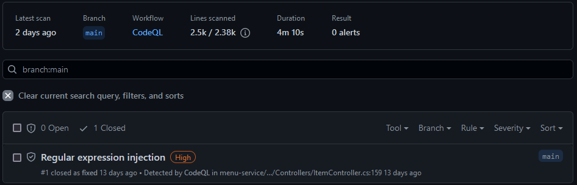
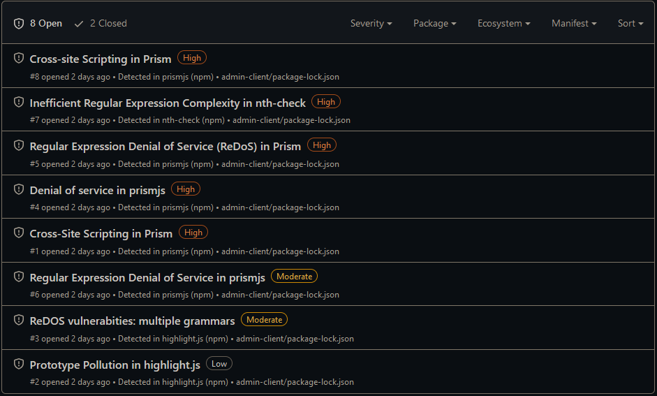
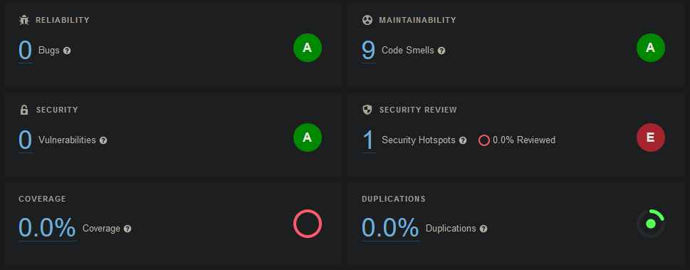
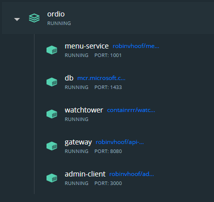
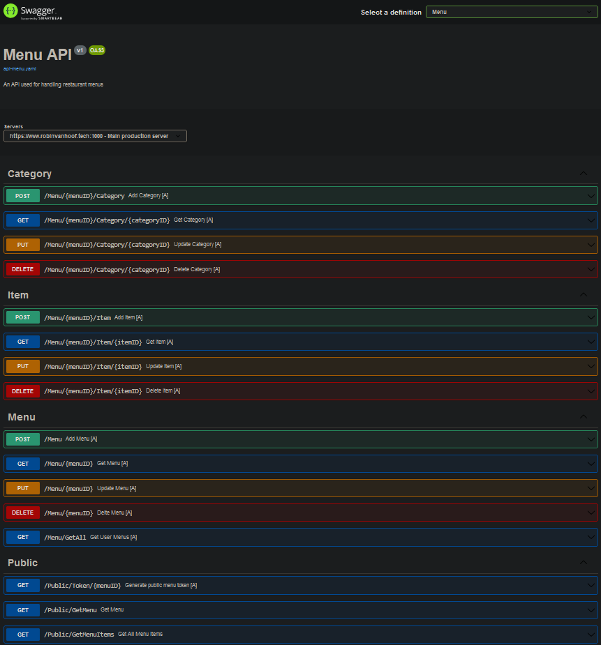

# Products and Learning Outcomes

In this document I will showcase the different products I have made during this project, and explain what parts of my deliver cover what outcomes.

<br>

## Table of Content
- [Ordio API application](#ordio-api-application)
- [GitHub](#github)
- [Docker](#docker)
- [API Documentation](#api-documentation)
- [Ordio admin webtool](#ordio-admin-webtool)
- [Testing](#testing)
- [Auth0](#auth0)
- [Public hosting](#public-hosting)

[Learning Outcomes](#learning-outcomes)

<br><br>

## Ordio API microservice
The first major product I have made for this project is the main API backend application that feeds the entire Ordio platform with all its data. This API containst two kinds of endpoints meant for two different purposes: Secured and Public access points. I decided to split these up because different application-integrations of the API require different levels of credentials. To make sure developers can make implementations where authorization is not at all required the enpdoints have been split in two categories. In turn, this also means the authorization-platform-details will not have to be publically accessible for external developers to work with Ordio.

### Secure access points
The first kind of access point are secure access points. These are any access points that require authorization through Auth0 (which will be touched upon later in the [Auth0](#auth0) chapter). These access points are most of the CRUA access points for the data and are mainly meant to only be accessed by authorized services. These access points provide authorized developers the possibility to manipulate the stored data through API calls.

I say CRUA instead of CRUD because of the nature of the service im providing: Since my platform is a portal for external developers to build applications upon, data is very valuable. Hence I made the decision to not Delete data as CRUD suggest but instead Archive any data. This means no data will be lost which might be important for unforseeable cases in the future.

<br>

### Public access points
The second kind of access point are Public access points. These access points are mainly access points used for accessing data without being able to edit the data the server has stored. These access points are the public access points developers can use to build their applications upon.

<br>

### Accessing the API
To make it easy to access the API endpoints and make future expansion through more microservices possible, all current and future API endpoints are not directly publicly accessible, but instead run through an API gateway. More about this is explain in the [API Gateway](#api-gateway) chapter.

<br>

### Demonstration
Here follows a quick video demonstration of the API. Postman is used to make the API calls for demonstration purposes.


<br>

### Outcomes
This product touches learning outcomes 1 and 2

<br><br>

## API Gateway
As touched upon earlier, all the Ordio endpoints are not publically accessible. Instead, all request run through one public API gateway. This provides a few key atvantages:
- All API access points are accessible through the same hostname;
- Adding new microservices is easy as new routes can easily be defined in the gateway;
- The gateway allows for call-throttling, DDOS protection and other integrated security protections;

The reason why I decided to go for an API gateway was because of two major key parts: First of all, all above given advantages an API gateway offers, but also because I want Ordio to be a scalable and proffesionaly build platform. Making use of an API gateway is the key to exactly this.

<br>

### Overview
The workings of the gateway can be summerised in this diagram:


What you can see in this diagram is the simulated path two requests from clients would take. In my implementation only the Menu service currently exists. However, because of the usage of an API gateway upscaling is very easy: To add more microservices, just define how to reach it in the API gateway and youre ready to go! All microservices are independent of one another and can be easily implemented without any hastle.

<br>

### Outcomes
This product touches learning outcomes 1, 2 and 4

<br><br>

## GitHub
After setting up the first version of the API microservice it was time to start working on a way to handle the project files: GitHub. I started by making a [GitHub company](https://github.com/FHICT-Ordio) to bundle all my required repositories together. My goal was to put every microservice, frontend application, the API gateway and every other independent service on its own repository, making they much more sustainable in the long run while still keeping everything in one place.

<br>

### CI/CD
Next up was CI/CD implementation. CI/CD stands for continuous integration and continuous delivery, meaning automation of integration and delivery/deployment of the many different aspects of the project. Every repository of my project runs roughly the same CI/CD process. This process contains a few different key steps:

- #### Build- and unit-testing
The first step of the CI/CD process is quite straight forword: Test if the application can be build successfully in the first place. If so, run all the applications unit tests. Do these also pass? If so, this step has succeeded. I decided to set up automated build- and unit-testing to ensure that only functional code can be pushed to the main branches meaning the live environment will always have functional code.

- #### Docker build-testing and deployment
The next step in the CI/CD process is docker testing and possibly deployment. All microservices and standalone applications of the Ordio project run in dockerized containers. More about this will be discusses later in the [Docker](#docker) chapter. Docker requires docker images to build its containers. These images are supplied trough Dockerhub.

Whenever a push or merge to a main branch occurs, the image on Dockerhub needs to be updated with the new most recent code. The CI/CD is responsible for this! First of all, GitHub will test if the dockerimage can be build from the new files in the main branch, using each branches custom made Dockerfiles. If the build succeeds, next the CI/CD process will log into Dockerhub with the credentials provided through GitHub secrets, and push the build docker image to their corresponding Dockerhub registries. If both these steps succeed the new image has successfully been deployed to Dockerhub and is ready for server-sided deployment.

- #### Swagger-collection
The next step in the CI/CD process is one only executed for API microservice branches. These branches contain yaml files with definitions for Swagger (Which will be talked about more in the [API Documentation](#swagger) chapter) to use for the generation of API documentation. However, in the case of multiple API microservices, having these Swagger files spread over possibly countless seperate repositories can be very frustrating and makes this documentation near to useless.

What if we could collect all these Swagger files and put them on one general branch then? We can! This step in the CI/CD process is responsible for exactly this: Whenever changes to an API microservice get pushed or merged to one of the repositories main branches, take said yaml file and push it to one main repository, where the independent files get combined into one Swagger interface: the Ordio Swagger portal. This page is hosted on GitHub where independent developers can use it to implement the API. The best part: Whenever any of the code of an API microservice changes, this Swagger portal also automatically updates the API definitions according to the current production code!

Because the Ordio platform could in the future contain more microservices I decided to put this collection step in the CI. This way, the documentation from all future microservices could be collected and displayed in one main page. This would make it easier for developers to use the API since they dont need to go through multiple swagger environments and make the application more professional.


<details>
    <summary>GitHub CI/CD Flow File (yaml)</summary>

``` yaml
name: Main

on:
  push:
    branches: [ main ]
  pull_request:
    branches: [ main ]

jobs:
  build:
    runs-on: ubuntu-latest
    steps:
    - uses: actions/checkout@v3
    - name: Setup .NET
      uses: actions/setup-dotnet@v2
      with:
        dotnet-version: 6.0.x
    - name: Restore dependencies
      run: dotnet restore "./menu-service/" 
    - name: Build
      run: dotnet build --no-restore "./menu-service/"
    - name: Test
      run: dotnet test --no-build --verbosity normal "./menu-service/"
    - name: Upload documentation file
      uses: actions/upload-artifact@v3
      with:
        name: docs
        path: ./menu-service/menu-service/api-menu.yaml
        retention-days: 1

  deployment:
    name: deployment
    runs-on: ubuntu-latest
    needs: build
    steps:
      - name: Checkout repository
        uses: actions/checkout@v2
      - name: Set up Docker Buildx
        uses: docker/setup-buildx-action@v1
      - name: Login to DockerHub
        uses: docker/login-action@v1
        with:
          username: ${{ secrets.DOCKER_HUB_USERNAME }}
          password: ${{ secrets.DOCKER_HUB_TOKEN }}
      - name: Build and push
        uses: docker/build-push-action@v2
        with:
          context: ./menu-service/
          file: ./menu-service/menu-service/Dockerfile
          push: ${{ github.event_name != 'pull_request' }}
          tags: ${{ secrets.DOCKER_HUB_USERNAME }}/menu-service:latest
  
  push-docs:
    runs-on: ubuntu-latest
    needs: build
    if: github.event_name != 'pull_request'
    steps:
      - uses: actions/checkout@v3
        with:
          repository: FHICT-Ordio/general
          token: ${{ secrets.PAT_TOKEN }}
      
      - name: Download docs artifact
        uses: actions/download-artifact@v3
        with:
          name: docs
      
      - name: Check Git status
        id: check
        run: echo "::set-output name=status::$(git status -s)"
      
      - name: Commit files
        id: commit
        if: steps.check.outputs.status != ''
        run: |
          git config user.name "github-actions[bot]"
          git config user.email "41898282+github-actions[bot]@users.noreply.github.com"
          git add .
          git commit -m "Add changes"
          git push
          
  sonarcloud:
    name: Sonar Cloud Build
    runs-on: windows-latest
    steps:
      - name: Set up JDK 11
        uses: actions/setup-java@v1
        with:
          java-version: 1.11
      - uses: actions/checkout@v2
        with:
          fetch-depth: 0
      - name: Cache SonarCloud packages
        uses: actions/cache@v1
        with:
          path: ~\sonar\cache
          key: ${{ runner.os }}-sonar
          restore-keys: ${{ runner.os }}-sonar
      - name: Cache SonarCloud scanner
        id: cache-sonar-scanner
        uses: actions/cache@v1
        with:
          path: .\.sonar\scanner
          key: ${{ runner.os }}-sonar-scanner
          restore-keys: ${{ runner.os }}-sonar-scanner
      - name: Install SonarCloud scanner
        if: steps.cache-sonar-scanner.outputs.cache-hit != 'true'
        shell: powershell
        run: |
          New-Item -Path .\.sonar\scanner -ItemType Directory
          dotnet tool update dotnet-sonarscanner --tool-path .\.sonar\scanner
      - name: Build and analyze
        env:
          GITHUB_TOKEN: ${{ secrets.GITHUB_TOKEN }}
          SONAR_TOKEN: ${{ secrets.SONAR_TOKEN }}
        shell: powershell
        run: |
          .\.sonar\scanner\dotnet-sonarscanner begin /k:"FHICT-Ordio_menu-service" /o:"fhict-ordio" /d:sonar.login="${{ secrets.SONAR_TOKEN }}" /d:sonar.host.url="https://sonarcloud.io"
          dotnet build ./menu-service/
          .\.sonar\scanner\dotnet-sonarscanner end /d:sonar.login="${{ secrets.SONAR_TOKEN }}"
```

</details>

<br>

### Security and quality assurance
GitHub also provides very useful tools to analyse your code and make sure no vulnerabilities slip through the cracks. My project uses two major technologies that check and notify about exactly this. These are also part of the CI/CD process. These technologies are the following:

- #### CodeQL
CodeQL is a static code analysis tool integrated in GitHub. For my project I set up CodeQL so that whenever a merge request onto any of the main branches is made, GitHub will first check the code quality and vulnerabilities before allowing said code to be pushed at all. Any vulnerabilities are noted and reported to the branches Security panel. If any of the vulnerabilities found are of High risk factor, the merge will be blocked until the vulnerabilities are fixed or the merge is forced through. I decided to use CodeQL as main static code analysis tool for one major reason: This tool is natively offered by GitHub, meaning its widely used and we can assume very accurate and secure. Furthermore, CodeQL is very powerful for testing both backend and frontend code and is very good at finding vulnerabilities that a developer would not find during normal code refactoring. CodeQL is fully automated in the CI step meaning no manual work is required.

- #### Dependabot
The second technology I use to ensure safe code for production environments is Dependabot. Dependabot is another integrated GitHub tool that automatically scans used dependencies of applications and reports if it finds any possible vulnerabilities with these depenencies. All issues found are noted and reported to the brances Security panel, and if any of the vulnerabilities found are of High risk factor, the merge will be blocked until fixed or the merge is forced through. Furthermore, Dependabot will also automatically try to fix any vulnerabilities found by either automatically updating packages for you, or finding different similar packages to use instead.

- #### SonarCloud
SonarCloud is another static code analisis tool. This is a thrid party tool without integrated GitHub support, but can be supplied with code through GitHub actions. Whenever a merge request is made, the code will also be sent to the SonarCloud service that analyses the code for possible vulnerabilities, code duplication, code smells and many more coding standards.

| CodeQL | Dependabot |
| --- | --- |
|  |  |
| **Sonar Cloud**  |

<br>

All these quality assurance tools run automatically. I implemented these to ensure code quality of live applications. In a development team the results of these can be used first of all to for example find bugs before they reach live environments, but also the ensure that code is safe, which could be a strong selling point for stakeholders. In a development project these platforms would need to be checked regularly since they require no active interaction. This could be done by for example looking at the results of these platforms in every sprint retrospective and picking a number of vulnerabilities to fix each following sprint.

<br>

### Outcomes
This product touches learning outcomes 2, 3 and 4

<br><br>

## Docker
All the applications that are part of the Ordio platform run in a live server environment. This is not in independent single applications, but the entire platform runs in one Docker unit, split in multiple containers: one for each microservice and application.

<br>

### Containers
In total, the platform runs using five unique containers. These containers are the following:

- #### Menu service container
This container hosts the Menu microservice, the API application described in the [Ordio API Micoservice](#ordio-api-microservice) chapter;

- #### Admin client container
This container hosts the Admin client application, the frontend application described in [Ordio Admin Webtool](#ordio-admin-webtool) chapter;

- #### Gateway container
This container hosts the API gateway application described in [API Gateway](#api-gateway) chapter;

- #### Database container
This container hosts the Ordio database. This is an MSSQL database which is responsible for storing all data the Ordio platform needs. The content of this database dynamically updates using Migrations whenever changes to the code structure are made;

- #### Watchtower container
To make sure all the containers stay up do date with the latest code on the main GitHub branches, I use an extension called Watchtower. Watchtower is a dockerised application running next to the other containers which on regular intervals checks if new images of the other appications have been pushed to DockerHub. If so, Watchtower wil automatically restart the container and pull the latest code to make sure the production environment always stays up to date. I decided to go for a Watchtower container as a quick solution for automated deploymen: This means that the code in running containers wil always be up to date with the latest GitHub main repository code. This in turn also makes running a public production environment possible and a lot easier;

<br>

### Compose
All these different containers are started and managed using Docker compose. Docker compose offers great customization that allows for startup sequences to be predefined in contrary to the commands that usually have to individually be entered to start individual containers with vanila docker. In this compose file a few key components are specified:
- Docker image to use for the container
- Volumes for containers for permanent data storage (without these volumes data gets reset on container restart)
- Environmental variables for the container
- Portbinding for container

<details>
    <summary>Docker Compose File (yaml)</summary>

``` yaml
version: "3.8"
services:
  # Support Services
  watchtower:
    container_name: watchtower
    image: containrrr/watchtower
    restart: always
    volumes:
      - /var/run/docker.sock:/var/run/docker.sock
      - /etc/timezone:/etc/timezone:ro
    command: --interval 300
  
  gateway:
    container_name: gateway
    image: robinvhoof/api-gateway:latest
    environment:
      # Host Bindings
      Kestrel__Endpoints__Http__Url: "http://+:2000"
      Kestrel__Endpoints__Https__Url: "https://+:1000"
      # SSL Bindings
      ASPNETCORE_Kestrel__Certificates__Default__Path: "/certs/fullchain4.pem"
      ASPNETCORE_Kestrel__Certificates__Default__KeyPath: "/certs/privkey4.pem"
    volumes:
      - ~/.aspnet/https:/https:ro
      - C:\Certbot\archive\robinvanhoof.tech:/certs
    ports:
      - 1000:1000
    networks:
      - service-network
      - default
  
  # Data Services
  db:
    container_name: db
    image: "mcr.microsoft.com/mssql/server:2019-latest"
    environment:
        SA_PASSWORD: "YjxFVK#C8kJZPk4l"
        ACCEPT_EULA: "Y"
    ports:
      - 1433:1433
    volumes:
      - ./mssql:/var/opt/mssql/data
    networks:
      - service-network

  # API Services
  menu-service:
    container_name: menu-service
    image:  robinvhoof/menu-service:latest
    environment:
      # Connection String Injections
      ConnectionStrings__MenuContext: "Server=db;Database=menu;User=sa;Password=YjxFVK#C8kJZPk4l;"
      # Host Bindings
      Kestrel__Endpoints__Http__Url: "http://+:2001"
      Kestrel__Endpoints__Https__Url: "https://+:1001"
      # SSL Bindings
      ASPNETCORE_Kestrel__Certificates__Default__Path: "/certs/fullchain4.pem"
      ASPNETCORE_Kestrel__Certificates__Default__KeyPath: "/certs/privkey4.pem"
    volumes:
      - C:\Certbot\archive\robinvanhoof.tech:/certs
    ports:
      - 1001:1001
    depends_on:
      - db
      - gateway
    networks:
      - service-network

  # Frontend Containers
  admin-client:
    container_name: admin-client
    image: robinvhoof/admin-client:latest
    environment:
      # API Host Definitions
      REACT_APP_API_URL: "https://api.robinvanhoof.tech"
      SSL_CRT_FILE: "/certs/fullchain4.pem"
      SSL_KEY_FILE: "/certs/privkey4.pem"
      HTTPS: "true"
    ports:
      - 3000:3000
    volumes:
      - C:\Certbot\archive\robinvanhoof.tech:/certs

  frontend:
    container_name: frontend-client
    image: robinvhoof/ordio-frontend:latest
    environment:
      # API Host Definitions
      SSL_CRT_FILE: "/certs/fullchain3.pem"
      SSL_KEY_FILE: "/certs/privkey3.pem"
      HTTPS: "true"
    ports:
      - 3001:3000
    volumes:
      - C:\Certbot\archive\robinvanhoof.tech:/certs

# Networking
networks:
  default:
    name: nginx-network
  service-network:
    driver: bridge
```

</details>

| Overview | Docker view |
| --- | --- |
|  |  |

<br>

### Outcomes
This product touches learning outcomes 1, 3 and 4

<br><br>

## API Documentation
Because of the nature of the Ordio platform being a portal for fellow developers to build upon using the APIs, the API documentation is a very big vital part of making sure the project stays alive: Without clear documentation on how to use it, there's no point in keeping the service running if no one knows what to do with it. This is why I put a lot of time into geting the API documentation to a high level which will also be touched upon in one of my Research topics.

<br>

### Swagger portal
The first major component of the API documentation is the Swagger portal. This Swagger portal is one place where all the current and future API endpoint are and will be documenten. The endpoint definitions here are set up to be automatically generated from the live code and set to update whenever changes to this live code happend.

Furthermore, the Swagger portal also offers the tools to directly make calls to either the live production servers or a local test server, which can be used to play around with and test the endpoints. 

The portal itself runs on a GitHub pag and doesnt depend on the APIs or other parts of the platform. This means that even if the APIs were to temporarily go down, developers could still use the information from the portal to write their code. 

> The Swagger portal can be found [here](https://fhict-ordio.github.io/general/).



<br>

### Developer Notes
Beside the documentation the Swagger Portal provides more documentation about the API for developers can be found on the Admin Webtool which will be talked about later in the [Ordio Admin Webtool](#ordio-admin-webtool) chapter. The Admin Webtool site has a developer section providing developers with in detail epxplainations on what endpoints to use for what purposes, how to use them, and in addition also giving you JavaScript and C# past-and-go code snippets for general API calls, and endpoint-specific API calls. 


> This developer page can be found [here](https://robinvanhoof.tech/development).


<br>

### Outcomes
This product touches learning outcomes 1 and 4

<br><br>

## Ordio Admin Webtool
The Admin Webtool is the main in-house frontend application of the Ordio platform. This web application integrates both Auth0 (which will be talked more about in the [Auth0]) and The Ordio API to function as a CRUD frontend that restaurant owners can use to create and minipulate their menus. Once a menu is created, the restaurant owner can request a menu token through the Admin Webtool that can be used to retreive the public menus with all sensitive data stripped through the public endpoints. External developers can make use of these tokens to determine what menu to import and display depending on what menu token was provided. 

The intergration of Auth0 priveds a safe and secure way for users to log in and makes sure only the owners of menus can edit their own menus. Login tokens or credentials are never stored nor client nor server sided making this login process very secure and reliable. Furthermore, any user data that is stored on the server side (like Auth0 user IDs) are always hashed using SHA256 hashing algorithms making it exponentially harder to do anything usefull with this information might it be leaked or access in some other way.

> The live production version of the Ordio Admin Webtool can be found [here](https://robinvanhoof.tech/).


<br>

### Outcomes
This product touches learning outcome 1

<br><br>

## Testing
Testing is build into the Ordio platform on multiple levels. Testing is import to first of all ensure an application works without having to manually test every part of it after an update, but can also be used to ensure the quality and functionality to stakeholders. Ordio runs tests on the following levels:

<br>

### Unit Testing
The first step is unit testing. This means testing the functionality of one specific application. In the Ordio platform this happens at two point: The menu-microservice and the admin webtool both have build in unit tests meant for ensuring the functionality of each application. The menu-microservice tests the backend for expected functionality of certain methods, while the admin webtool runs frontend tests meant for testing user-interaction with the application.

<br>

| Menu-microservice | Admin webtool |
| --- | --- |
|  <br> I decided to test these two classes as they are important classes for the security of the microservice and user information |  |

These unit tests are run automatically through GitHub actions and are required to pass for code to be pushed to the main branch of the GitHub repositories, which means code functionality on the main branch and thus live environment can be assured to be functional.

<br>

### Integration Testing
Another important part of testing projects like these is Integration testing. Integration testing means externally testing a service or application without the use of external services. Integration testing can be used to fully test the functionality of an application and if/how they would work together with other application. Unfortunately, due to time restraints, I was not able to implement Integration tests into the Ordio platform. However, integration tests are a very important testing step and would be very important for any large scale project.

<br>

### Outcomes
This product touches learning outcome 2

<br><br>

## Auth0
Auth0 is the second Microservice used in the Ordio platform. Auth0 is an external microservice that takes the responsibilty of user authorization and handels this in a very secure and safe way. The platform is widely used in the entire industry, even in many big applications and companies. 

Both the API application and Admin Webtool integrate Auth0 in two different ways: The API application integrates Auth0 to check the validity of supplied tokens and request user information using the tokens while the Admin Webtool integrates Auth0 to create login pages for the site and provide the site with user tokens that can be send with API request to authorize and identify what user made the request. 

I decided to use Auth0 for authorization service over other similar services because Auth0 is a industry-wide accepted standard and used by many big developers and companies. Furthermore, Auth0's main edge over other competitors its the documentation and step-by-step installation guides they offer, which other platforms like for exaple JumpCloud dont offer.

<br>

While setting up the Auth0 services I ran into some major issues that sparked the idea for a Research topic for this project.

| Auth0 Login ||
| --- | --- |
|  |  |

<br>

### Outcomes
This product touches learning outcome 2

<br><br>

## Public Hosting
Because Ordio is an API platform for external developers to build their applications upon, public hosting is a very important step for my project, which is why I spend a lot of time into this working properly. I took a few big steps in making public hosting possible:

<br>

- ### Exposing Application
The first step in publishing the Ordio platform is to make an outside connection to both the API and frontend possible. This is done by first of all exposing the different docker containers to the host system through port binding, and exposing the host system to the public through ipforwarding. Using this I made my applications publicly accessible. This set up in the following way


<br>

- ### SSL
The next step was setting up SSL certificates for both the API and Admin Webtool. This step might seem abundant as hosting sites over SSL would not seem necessary, but there are however two reasons why it is required:

> - #### Auth0
> The frontend Admin Webtool uses Auth0 for authorizing users. However, if hosted outside of a "localhost" environment Auth0 <b>requires</b> any applications running it to run over a secured HTTPS connection. If an application is not, Auth0 will not work.

<br>

> - #### Loading non HTTPS into HTTPS
> The second reason is that a lot of browsers dont allow pages to load non-secure sources into secured pages. This means that if the API does not run on HTTPS, the API cannot be called by other sites that do run HTTPS. Since te frontend is required to run on HTTPS becouse of the previous reason, the API also needs to run over a secured connection.

Initially, a self-signed developer SSL certificate was set up for three services: The Admin Webtool frontend, the API Gateway and the Menu service. However, a DNS was setup up later (Will will be talked about more below) making use of an official SSL certificate from a Certificate Authority possible. I aquired one through Let's Encrypt and applied this one to the above-mentioned pages. This process is further detailed in one of my Research topics.


<br>

- ### DNS
The last step in publishing the Ordio platform was setting up DNS records for the domain. A DNS allows users to put a custom URL into the adress bar instead of the IP of the host. I bought a custom domain for this [www.robinvanhoof.tech](https://robinvanhoof.tech/) which now hosts the Ordio platform, making it more accessible for developers and users alike

<br>

### Outcomes
This product touches learning outcome 1

<br><br><br>

# Learning Outcomes
The products above all cover parts of the learning outcomes. Below a table summerizing all outcomes and products that show these outcomes:

| Outcome | Products |
| --- | --- |
|  1. Web application: You design and build user-friendly, full-stack web applications. | [Ordio API Microservice](#ordio-api-microservice), [API Gatewayway](#api-gateway), [Docker](#docker), [API Documentation](#api-documentation), [Ordio Admin Webtool](#ordio-admin-webtool), [Auth0](#auth0), [Public Hosting](#public-hosting) |
|  2. Software quality: You use software tooling and methodology that continuously monitors and improve the software quality during software development.  | [Ordio API Microservice](#ordio-api-microservice), [API Gateway](#api-gateway), [GitHub](#github), [Testing](#testing) |
| 3. CI/CD: You implement a (semi)automated software release process that matches the needs of the project context. | [GitHub](#github), [Docker](#docker) |
| 4. Professional: You act in a professional manner during software development and learning. | [API Gateway](#api-gateway), [GitHub](#github), [Docker](#docker), [API Documentation](#api-documentation), [Auth0](#auth0), [Research](https://github.com/FHICT-Ordio/general/tree/main/Portfolio/IP/Research) |