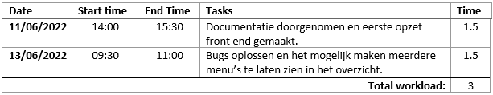

# Dependability Research

## Acknowledgements
Parts of this research were made with cooperation of third parties. I would like to thank the following people for their contributions:

 

> Jeffrey Derksen, Software Engineer

For their involvement as external software developer as testgroup for this research.

 

> Jasper Sijben, Software Engineer and game designer
 
For their involvement as proof-reader for this report.

 

> Evalynn Luna Kootstra, Software Engineer

For their involvement as proof-reader for this report.

  

## Table of content
- [Acknowledgements ](#acknowledgements)
- [Summary](#summary)
- [Acronyms](#acronyms)
- [Introduction](#introductions)
- [Methodology](#methodology)
- [Results](#results)
- [References](#references)
- [Appendices](#appendices)
- [Tables](#tables)

  

## Summary
This research looks into the dependability of the platform I developed named "Ordio". To determine this, I looked into the difficulty of implementing the platform into applications by external developers using only publically accessible documentation. An implementation of the platform was made to test this by [Jeffrey Derksen](https://github.com/jeffrey-fontys). The final proof of concept application can be found [here](https://robinvanhoof.tech) and the code of this proof of concept can be found [here](https://github.com/FHICT-Ordio/ordio-frontend-poc).

 

This research showed that implementing the Ordio platform was very quick and efficient due to the resources publically provided. No further communication or resources were required outside of the publically accessible ones, meaning external developers could implement the platform without the need of internal developers, making the platform completely independant.

  

## Acronyms
| Word | Definition |
| --- | --- |
| Ordio | The project this research was based on. |
| API | Application Programming Interface, a collection of public accesspoints that developers can use to request data from a service. |

  

## Introductions
This report will describe and document the execution of my individual free-topic research. This research will be based on my indiviual project "Ordio". More information about Ordio can be found in my individual portfolio.

This research will focus on the dependability of my in-house developed platform Ordio. Ordio is in essence a platform for other developers to build upon and offers developers a platform to use when building digital ordering applications for restaurants and food services alike. Ordio can provide menus for these applications and gives restaurant owners an application to create and import their menus easily.

 

Because of its nature Ordio is not a very powerfull platform on its own. What gives the platform power is external developers building their applications on top of the existing platform. However, to make this possible in the first place one aspect is very important: The difficulty of integrating Ordio into new applications.

  

## Methodology
This research will take a better look into difficulty of integrating the Ordio platform into new applications for external developers with the provided documentation. The main research question is as follows:

> How independent is the Ordio platform?

 

To help answer this question I split the main research question into multiple sub questions:

1. What documentation does an external developer need to implement the Ordio platform into a new application?

2. How much time does an external developer need to learn how to use and implement the Ordio platform in their application with the given documentation?

3. How difficult is the implementation process of Ordio for external developers with the given documentation?

4. How much extra communication between in-house and external developers besides the public documentation is needed to comfortably implement Ordio into a new application?

 

### Research Stratagies
This research was conducting using the DOT framework (**D**evelopment **O**riented **T**riangulation). The following research stratagies will be used for each research question:

| Research Question | Research Strategy |
| --- | --- |
| **(1)** What form of documentation does an external developer need to implement the Ordio platform into a new application? | Library-, Showroom- and Workshop-research |
| **(2)** How much time does an external developer need to learn how to use and implement the Ordio platform in their application with the given documentation? | Workshop-research |
| **(3)** How difficult is the implementation process of Ordio for external developers with the given documentation? | Workshop- and Field-research |
| **(4)** How much extra communication between in-house and external developers besides the public documentation is needed to comfortably implement Ordio into a new application? | Workshop-research |

 

### Instruments
To cunduct and manage this research a number of instruments are used. These are the following:

- Questionnaire

In this research a questionnaire will be used to get an insight into the difficulty of implementing the Ordio platform into a new application by external developers. This questionnaire will be filled in by our testgroup. A copy of the questionnaire is included in appendice [A.1B](#appendices).

- Timelog

I this research a timelog will be used to get an insight into the time external developes need to learn how to use and implement the Ordio platform into their application. This timelog will be filled in by the testgroep. A copy of the timelog is included in appendice [A.1A](#appendices).

- Communicationlog

In this research a communicationlog will be used to get an insight into the amount of extra communication required besides the public documentation for an external developer to make an integration of the Ordio platform into their application. This log will document when communication takes place, how long the conversation lasts and what is discussed in this conversation. A copy of the communicationlog can be found in appendice [A.1C](#appendices). 

 

### Testgroup
To conduct this research an implementation of an application using the Ordio application needs to actually be developed. This is a very time-consuming task which makes conducting this research on a large testgroup impractical due to a lack of fund and time.

For this reason a testgroup of one singular developer will be used to conduct this research. All gathered data will come from this one developer. The selection of this developer is not on random basis but will be picked from a close environment with a background in (web)development but **no** experience with the Ordio platform.

 

### Datacollection
This research will collect two main points of data: The time it takes for a developer to implement the Ordio platform into their application and the difficulty of executing this task. Throughout the entire development process a digital timelog will be used by the testgroup to gather data about time consumption. A digital questionnaire will be filled in at the end of the development stage by the testgroup to gather data about difficulty of implementation.

 

### Limitations
This research has a few limitations it might run into. The biggest limitation is the small testgroup. Due to the amount of time needed to develop an implementation required of every individual testgroup-member it is very unrealistic to take a bigger testgroup. This small testgroup can influece the result of the research.

Second of all, the fact that the single testgroup developer that was chosen from close environment can introduce possible limitations: It is possible that prior knowledge of the Ordio platform is present through hearsay which means more knowledge then the average developer about the platform is present, possible clouding the result of the research.

  

## Results
> ### What form of documentation does an external developer need to implement the Ordio platform into a new application?

 

Before setting the testgroup out to develop applications with an implementation of the Ordio platform documentation that specifies how the platform should be used needs to be written. This brings up the following question: What documentation do developers need to make said implementation?

To determine this I started a research detailing what would be needed to comfortably achieve this goal. I started by looking at other platforms that provide developers with similar services and looked into what these platforms offered their developers. I looked into the following services:

 

- Auth0

Auth0 is a service that provides authorization features to devlopers to use in their front- and backend projects. This works through means of a public API that can be called upon to do multiple actions, from retreiving user-authorization tokens to validating tokens and retreiving userdata.

Auth0 conveys the usage of their API to developers using two platforms. The first platform is their custom made [documentation wiki](https://auth0.com/docs/api/authentication) that documents in-depth all the inner workings of the standalone API. This wiki is very in-depth containing over 50 pages filled with documentation.

The second platform Auth0 offers is directly integrated into their administration panel. This administration panel is a place for developers to set up their Tannents in the first place, meaning its very easy to find. The documentation given here is done in a more narrow form, focussing on specifically quickly integrating the authorization process into both front- and backend applications. This platform provied the developer with custom paste-and-go code snippets in many programming languages that make integrating the API an extremely easy and pleasant process.

| Auth0 Wiki | Step by step snippet guide |
| --- | --- |
|  |  |
 

- Magento

Magento is a service that provides developers with easy to use databases. The main access point for these databases is not through SQL but instead through a variety of CRUD API access points. Magento offers documentation about this API on two platforms:

The first platform is a [Magento Wiki](https://devdocs.magento.com/guides/v2.4/rest/generate-local.html) fairly simmilar to the Auth0 Wiki and provides in depth documentation on the inner workings of the API. This Wiki addresses all endpoints, how to use them, what they return and what happens if something goes wrong.

The second platform Megento offers is a live Swagger environment. This swagger environment is a swagger page that gets hosted along every instance of database and documents all installed accesspoints (uncluding access points installed through extensions) for developers to use. An example of this swagger enviornment can be found [here](https://www.toprc.nl/swagger).

| Magento Wiki | Magento swagger environment |
| --- | --- |
|  |  |

 

- Twitch

Twitch is an open broadcasting platform thats mainly used by gamers to livestream games. However, Twitch also offers a massive API service that provides external sources with a lot of information about their platform and users.

Twitch uses one big platform to convey documentation about their API platform to developers. This is a big [Wiki](https://dev.twitch.tv/docs/) very similar to the Wikis from both Auth0 and Magento. This Wiki provides information on how to use all their access points, what responses to expect and details all processes around the API including for example requesting API keys.

 

After looking at the mentioned sources I concluded that all these platforms have one thing in common: They all contain extensive Wikis documenting exactly how to use the APIs and environments around them for developing purposes. Furthermore, during this project and in previous projects I have worked with all three these APIs and their documentations. Every platform has their own strenghts and weaknesses:

| Platform | Strenghts | Weaknesses |
| --- | --- | --- |
| Wiki-format | Provides an extreme amount of information, navigation to specific topics is very easy | Very time consuming to set up and maintain, mostly usefull for very big APIs and applications |
| Swagger environment | Gives possibility of dynamically generating documentation, very low maintenance | Need to run on independent server or service, though endpoints can very well-documentend it cannont give information about the context around the API application (eg providing login or requesting API keys) |
| Step-by-step snipet guide | Very usefull for quick development implementation, can take a lot of work away from the developer if set up correctly | In case the API ever changes all code snippets need to be rewritten or updated, although low maintance the setup requires a lot of resources |

 

To define what type of documentation would be most applicable to the Ordio platoform we first need to determine what aspects are important. First of all, we want a documentation solution that is rather quick to set up becouse of time constraints. Second of all, we have a rather small-scaled application meaning we dont need expansive documentation as there is not that much to document in the first place. Third of all, we want a documentation platform that provides developers with the posibility to very quickly implement the API and build on from that.

 

Taking the above mentioned aspects in mind, a conclusion can be drawn. Since the scale of the application is not big enough to wirte extensive in depth documentation for, a Wiki-format platform would be to big of a platform for the Ordio platform. This leaves Swagger and Step-by-step guides. On their own neither of these can provide a full picture of the API and its context. However, together these two would form a powerful tool that can cover all basis of the application and in addition give developer the tools to implement the API in mere minutes as reusable code snippets can be provided through this guide.

 
That brings us back to the main question: <i>What documentation does an external developer need to implement the Ordio platform into a new application?</i>

 

A combination of Swagger endpoint documentation and a Step-by-step implementation guide.

  

> ### How much time does an external developer need to learn how to use and implement the Ordio platform in their application with the given documentation?

 

To determine how much time an external developer needs to learn how to use and implement the Ordio platform in their application with the given documentation, one was asked to make an implementation with this documentation. During this process the amount of time spend researching and implementing the platform was noted. The result of this can be found in table [T.1A](#t1a---timetable). 

From this date the following conclusion can be drown: an implementation of the Ordio platform in an application could be made very quickly, taking only three hours, half to one of which being spend researching the platform and implementation methods. This is a very short time concidering the external developer had no previous knowledge about the Ordio platform.

  

> ### How difficult is the implementation process of Ordio for external developers with the given documentation?

 

To determine the difficulty of the implementation process of the Ordio platform for external developers with the given documentatio, a questionnaire was used. This questionnaire asked a few general questions about the implementation process. The result of this questionnaire can be found in table [T.3A](#t3a---questionnaire).

From this questionnaire the following conclussions can be drawn: the external developer had no issue implementing the Ordio platform with the given documentation, and the documentation provided was clear, easy to use, and usefull.

 

Furthermore, a small interview was held about the implementation proccess. The result of this interview was as follows:

 

> What part of the documentation did you find most usefull?

I found the Swagger portal very usefull. Furthermore, the provided code snippets made the implemntation process so much more fluent. Defintely a big help!

 

> Did you miss any documentation that would've helped you in your implementation process?

No, everything that was needed for implementing the platform was provided through the public documentation. I did not feel like any more information would be necessary.

  

> ### How much extra communication between in-house and external developers besides the public documentation is needed to comfortably implement Ordio into a new application?

 

To determine the amount of extra communication needed between te testgroup and in-house developers all communication relating to the implementation of the Ordio platform will be documented over the course of this research. All the collected data from the testgroup is documented in table [T.A1](#tables). From this information the following conclusions can be drawn:

 

Very litle to no aditional communication was required. A total of around 20 minutes of communication was held, 10 of which being about the requirements and introduction. The other communication was not about the implementation of the Ordio platform, but rather about a small bug with the existing Admin webtool, meaning no additional communication besides the provided public documentation was needed about the implementation to make an implementation of the ordio platform as external developer.

  

## References
> Marcelmeesters and various authors. (2018, February 9). *The DOT Framework*. Retreived May 30, 2022, from WikiText: https://ictresearchmethods.nl/The_DOT_Framework

  

## Appendices
> ### A.1A - Copy of the timelog

 

> ### A.1B - Copy of the questionnaire

 

> ### A.1C - Copy of the communicationlog

  

## Tables

> ### T.1A - Timetable

 

> ### T.2A - Communication Log

 

> ### T.3A - Questionnaire
