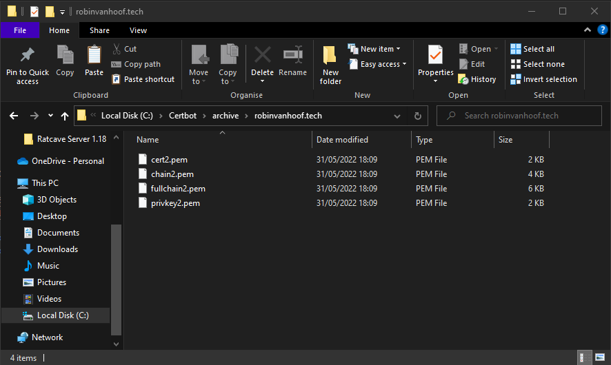

# SSL Security Research
This documentent contains the SSL Security Research conducted for my individual project "Ordio". More information about the Ordio application can be found in the [IP Documentation](https://github.com/FHICT-Ordio/general/tree/main/Portfolio/IP). 

 

## Table of Contents
- [Acronyms](#acronyms)
- [Introduction](#introduction)
- [Methodology](#methodology)
- [Results](#results)
- [References](#references)

  

## Acronyms
| Word | Definition |
| --- | --- |
| Ordio | The project this idea of research topic sparked from |
| HTTP | Hyper Text Transfer Protocol, the standard transfer protocol for web applications |
| HTTPS | Secured Hyper Text Transfer Protocol, similar to HTTP, however extra security measurements are included in this transfer protocol |
| DNS | Domain Name System, a service to map a url aka domain (for example robinvanhoof.tech) to a public IP address (86.92.40.132) |

  

## Introduction
This report will describe and document the execution of my individual security-research topic.

This research will focus on SSL security on applications, the idea of which sparking from issues I ran into in my individual project "Ordio". Ordio is in essence a platform for other developers to build upon and offers developers a platform to use when building digital ordering applications for restaurants and food services alike. Ordio can provide menus for these applications and gives restaurant owners an application to create and import their menus easily.

  

## Methodology
This research will take a better look into SSL certification for (web) applications. The main research question this research will be answering is as follows:

> How can a developer apply SSL certificates to their dockerized application?

 

To help answer this question I split the main research question into multiple sub questions:

1. What are SSL certificates?

2. Why would a developper apply SSL certifications to their applications?

3. How can a developer get an SSL certificate?

4. How do SSL certificates integrate with Dockerized applications?

 

### Research Strategies
This research was conducting using the DOT framework (<b>D</b>evelopment <b>O</b>riented <b>T</b>riangulation). The following research stratagies will be used for each research question:

| Research Question | Research Strategy |
| --- | --- |
| <b>(1)</b> What are SSL certificates? | Library-research |
| <b>(2)</b> Why would a developper apply SSL certifications to their applications? | Libary-research |
| <b>(3)</b> How can a developer get an SSL certificate? | Libary- and Workshop-research |
| <b>(4)</b> How do SSL certificates integrate with Dockerized applications? | Library- and Workshop-research |

 

### Instruments
To cunduct and manage this research a number of instruments are used. These are the following:

- Ordio application

In this research the before mentioned Ordio application will be used as example project to which the SSL certificates will be applied for research purposes. More about this appliation can be found in the application documentation.

 

### Limitations
This research has a few limitations it might run into. The biggets limitation is the fact that this research will only look into how to apply SSL certificates to a small amount of application types: React and ASP.NET applications. This means that the result of this research will not be usefull for everyone as the methods to apply certificates might differ slightly between application types.

The second limitation this research might run into is the fact that the applications this research will focus on are dockerized applications. This means that the result might not be applicable to every application as non-dockerized application apply SSL certificates in different ways. Though this is a fairly small limitation as this difference is only very small and big parts of the application method are still the same.

  

## Results
> ### What are SSL certificates?

 

Before we can try to figure out how to apply an SSL certificate to an application its important to figure out what an SSL certificate is in the first place!

> SSL stands for Secure Sockets Layer and, in short, it's the standard technology for keeping an internet connection secure and safeguarding any sensitive data that is being sent between two systems, preventing criminals from reading and modifying any information transferred, including potential personal details.
>> *Taken from DigiCert at [digicer.com](https://www.websecurity.digicert.com/security-topics/what-is-ssl-tls-https)*

 

In short an SSL certificate is a certificate provided by a trusted source called a Certificate Authority (also known as an SSL CA) that ensures the browser and in turn users that a connection to a host will always be mode in a secure, protected and encrypted way. This means that a site running an SSL certificate can be trusted to at least transfer data in a safe way without the posibility of intercepting communications by a third party during the transfer.

 

An SSL certificate usually comes in the form of a generated file that the developer has on the host system and is included in applications for them to work on. When a client (e.g. a webbrowser) makes a connection to the host over a HTTPS connection it will request a copy of the SSL certificate. The client will then check the certificate to see if it was handed out by a CA (Certificate Authority) and thus check if the certificate can be trusted. If so, the client will return an acknowledgement and start an encrypted session over which any further encrypted data can be send.

  

> ### Why would a developper apply SSL certifications to their applications?

 

For a developer there are multiple advantages to applying an SSL certificate to your web applications. These range from the obvious security advantages to less obvious advantages like cross-page loading of content. The most promemenent advantages are as follow:

 

- #### Security
First of all, the most obvious advantages are the many security advantages SSL and HTTPS offers. As discussed before, a HTTPS connection has build in security in the form of encrypted connections. This means that data transfers between client and host will always be two-way-encrypted, making it impossible for third parties to intercept and use any data trasfered, protecting against many forms of modern cyber-attacks like for example man-in-the-middle attacks since the cought data cannot be read without the proper keys.

 

- #### Cross-page contect loading
A second mejor advantages of running your web application on HTTPS is loading content of your webpage or web application on other sites. HTTP and HTTPS applications can work perfectly fine alongside, however theres one catch: HTTP applications can load content from secured HTTPS sources but not the other way around. This means if a webservice is not running secured without SSL certificate on HTTP, the content of the application cannot be loaded into secured HTTPS pages. This mainly applies to API applications but is a very important aspect in these types of applications as you dont want to force a developer making use of the application into using unsecured HTTP.

 

- #### External services
Thirdly, when using many external (API) services a HTTPS host is required to even make use of them if hosted on a live environment outside of localhost. A good example of this is Auth0, which was also the inital reason why I started this research. Auth0 requires a secured client to host connection to make use of the Auth0 service possible on any host-environment outside of localhost. 

  

> ### How can a developer get an SSL certificate?

 

There are multiple ways for a developer to get an SSL certificate. To get one, you will need to go through a registered Certificate Authority (CA) first. Theres multiple options for these, many paid ones but also free options. 

 

#### Paid certificate
First off, a CA needs to be selected that suits your needs. Many CAs offer many different types of SSL certificates. There are SSL certificates that just cover one domain, certificates that can cover multiple domains, but for example also so called "wildcard" certificates that cover a base domain and all its subdomains. 

 

When a CA that suits your pricerange and requirements is selected you can move on to aquiring the certificate. First, depending on what kinda of SSL certificate was selected, you need to give information about your host. This will mainly be a domain or multiple domains that you want the SSL to apply to. This means a DNS (Domain Name System) is also required to run an SSL certificate. 

 

Once this is done the CA will hand out a certificate in the form of a set of certificate files that can be put on the host system and applied to your web applications.

  

#### Free certificate
Besides paid certificates there are also many free options to aquire SSL certificates. Once again, one would need to go through a CA. Not many CAs provide free SSL certificates, however there are some that do. For exmaple Let's Encrypt. Lets Encrpyt allows developers to automatically generate free SSL lisences for their domains. Once again, as a domain is required, the developer needs to have a publically accessible service accessible through a DNS.

 

To get started aquiring an SSL lisense through Let's Encrypt, a developer would need to download the CertBot tool through their website or through the host systems terminal. This tool will be responsible for generating the certificate.

 

Once installed, CertBot can be run to create your certificate. CertBot will request a domain for which to generate a lisence. Then it wil host a simple server on your host system on default HTTPS port 80. You need to make sure this port is accessible to the outside through the given domain name. CertBot will try to make a connection to itself through the domain name to check if you are in fact the owner of the domain. If so, CertBot will generate and sign an SSL certificate for you to use on your applications. 

  

> ### How do SSL certificates integrate with Dockerized applications?

 

As discussed before, for a web application to run on HTTPS using SSL certificates the SSL certificate needs to be accessible for the application since it needs to be send to the client when creating a connection. Normaly when the SSL certificate is present on the host system this is no problem, however when using Dockerized applicataions this changes! Since an applications inside a container is technically not run on the host pc but a Virtual Machine the application under normal circumstances wont have access to the certificate files. We need a workaround for this!

 

This issue can resolved in two ways. The first way would be to generate a new SSL certificate every time a Docker container boots up. This is howerver a very roundabout way since a new unique SSL lisence would need to be generated when using a service like CertBot for ever single container. This obviously brings many issues to the table that cannot easily be resolved.

 

However, to circumvent this whole issue in its entirety, Docker offers an optional setting called Volumes. A volume is in theory a shared pieces of disk storage between the host device and a container. This means any files created in the container in this piece of storage will also be accessible and retained on the host system. However, most importantly this also works the other way around! Any files originally stored in the shared storage will also be accessible on the container. This means one SSL certificate can be generate on the host system and can then be provided to the containers through a shared volume. 

| Host System | Docker container |
| --- | --- |
|  |  |
|  |  |

 

Finally, depending on what development framework you use, you need to specify in some form where the application can find the SSL certificate it should use. Every opperating system has a default path for SSL certificates, however a lot of development frameworks also allow you to specify custom paths. This is done in dockerized applications through Environmental Variables. Two examples of these environmental virables for React and ASP.NET are given below:

| React | ASP.NET |
| --- | --- |
|  React uses the *SSL_CRT_FILE* and *SSL_KEY_FILE* environmental variables together with the *HTTPS* variable to specify the React app should use an SSL Certificate |  ASP.NET uses Kestrel and the *ASPNETCORE__Certificates__Default__Path* and *ASPNETCORE__Certificates__Default__Password* environmental variable which overrides the appsettings configuration. |

  

## References

> Elementor. *What is an SSL certificate?*. Retreived June 6, 2022, from Elementor: https://elementor.com/resources/glossary/what-is-an-ssl-certificate/

 

> Digicert. *What is SSL, TLS and HTTPS?*. Retrieved June 6, 2022, from Digicert: https://www.websecurity.digicert.com/security-topics/what-is-ssl-tls-https

 

> Certbot. *Certbot Instructions*. Retreived June 9, 2022, from Certbot:
https://certbot.eff.org/instructions?ws=other&os=windows